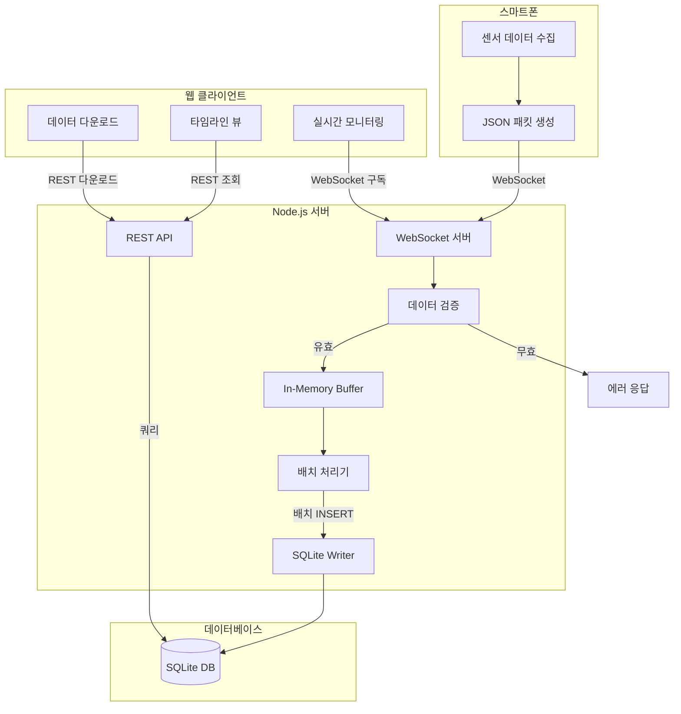
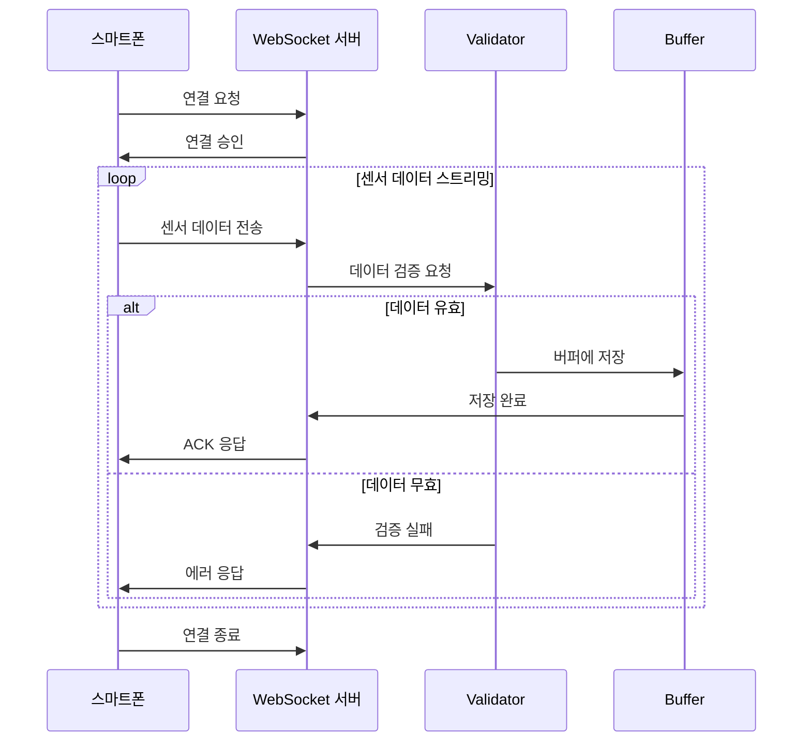
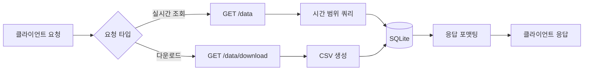
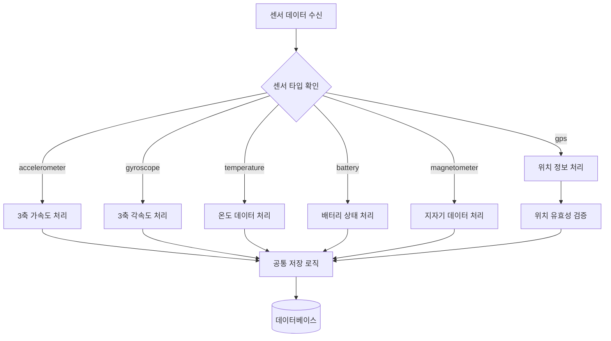
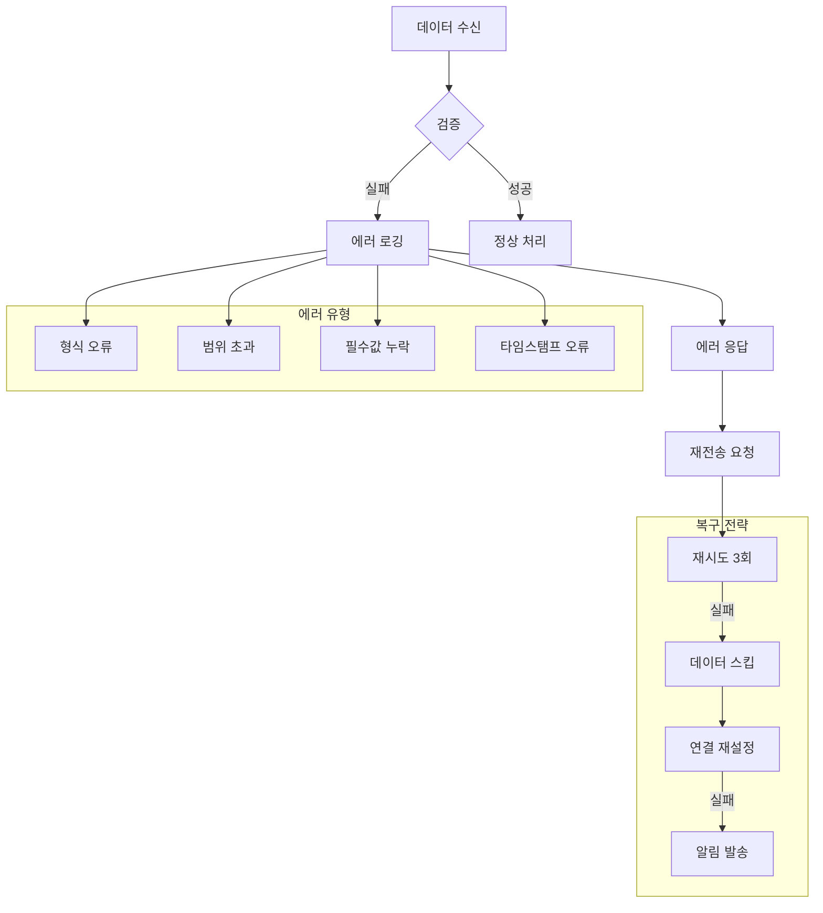
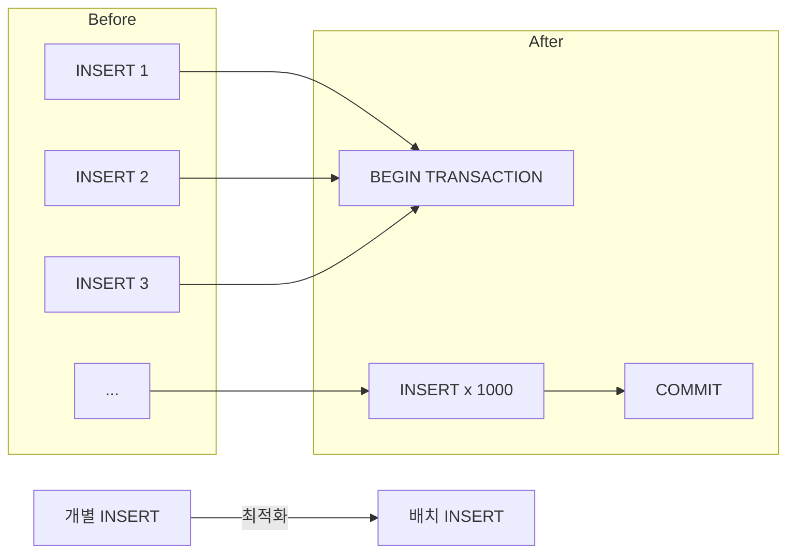
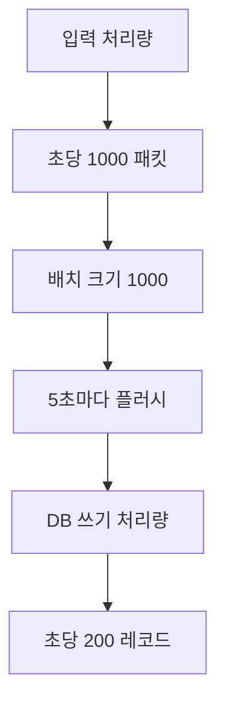
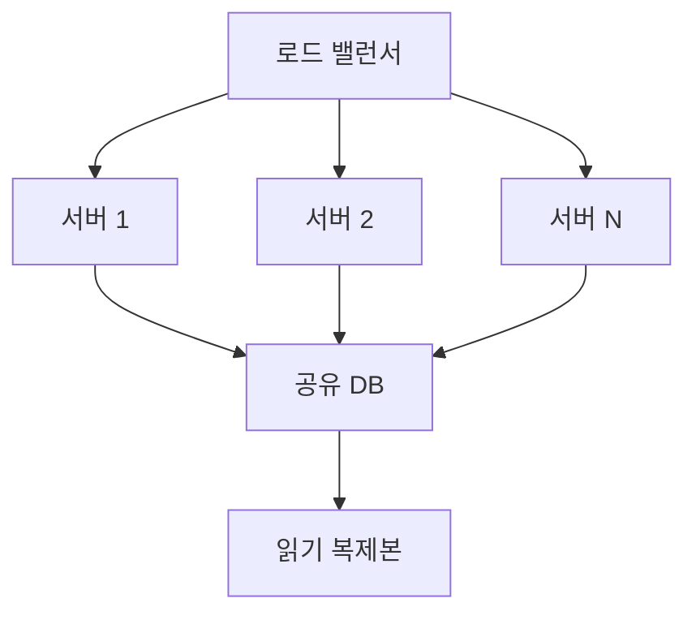

# AMR QC 솔루션 - 데이터 플로우 설계 문서

## 1. 데이터 플로우 개요

AMR QC 솔루션의 데이터는 다음과 같은 경로로 흐릅니다:

```
스마트폰 센서 → WebSocket → Node.js 서버 → In-Memory Buffer → SQLite DB → REST API → 웹 클라이언트
```

## 2. 전체 데이터 플로우 다이어그램



## 3. 단계별 상세 시나리오

### 3.1 데이터 수집 단계 (스마트폰)

1. **센서 데이터 수집**

   - 가속도계, 자이로스코프, GPS 등 6종 센서에서 데이터 수집
   - 샘플링 주기: 센서별 10Hz ~ 100Hz

2. **JSON 패킷 생성**
   ```json
   {
     "deviceId": "AMR-001",
     "sensorType": "accelerometer",
     "timestamp": 1640995200000,
     "value": {
       "x": 0.98,
       "y": -0.15,
       "z": 9.81
     }
   }
   ```

### 3.2 데이터 전송 단계 (WebSocket)



### 3.3 데이터 저장 단계 (배치 처리)

1. **In-Memory Buffer 관리**

   - 버퍼 크기: 최대 1000개 레코드 또는 5초
   - 버퍼 플러시 조건:
     - 1000개 레코드 도달
     - 5초 경과
     - 수동 플러시 요청

2. **배치 INSERT 프로세스**
   ```javascript
   // 의사 코드
   async function flushBuffer() {
     const batch = buffer.drain();
     const transaction = db.transaction(() => {
       for (const data of batch) {
         insertStatement.run(data);
       }
     });
     transaction();
   }
   ```

### 3.4 데이터 조회 단계 (REST API)



## 4. 센서 타입별 처리 분기



### 4.1 센서별 검증 규칙

| 센서 타입     | 검증 규칙                    | 단위    |
| ------------- | ---------------------------- | ------- |
| accelerometer | x, y, z 필수, 숫자 타입      | m/s²    |
| gyroscope     | x, y, z 필수, 숫자 타입      | rad/s   |
| gps           | 위도(-90~90), 경도(-180~180) | degrees |
| temperature   | 절대영도 이상(-273.15°C)     | °C      |
| battery       | 레벨(0-100), 충전상태        | %       |
| magnetometer  | x, y, z 필수, 숫자 타입      | μT      |

## 5. 오류 처리 흐름



### 5.1 에러 처리 시나리오

1. **WebSocket 연결 오류**

   - 자동 재연결 (최대 3회)
   - 지수 백오프: 1초, 2초, 4초

2. **데이터 검증 오류**

   - 에러 로그 기록
   - 클라이언트에 에러 코드 전송
   - 데이터 스킵 또는 기본값 사용

3. **DB 쓰기 오류**

   - 트랜잭션 롤백
   - 버퍼에 데이터 보관
   - 다음 배치에서 재시도

4. **버퍼 오버플로우**
   - 오래된 데이터부터 제거 (FIFO)
   - 경고 로그 생성
   - 모니터링 알림

## 6. 성능 최적화 전략

### 6.1 배치 처리 최적화



### 6.2 메모리 버퍼 관리

- **버퍼 크기**: 동적 조정 (100 ~ 1000 레코드)
- **플러시 전략**:
  - 시간 기반: 5초마다
  - 크기 기반: 1000개 도달 시
  - 우선순위: 중요 데이터 즉시 플러시

### 6.3 인덱스 전략

```sql
-- 주요 쿼리 패턴에 따른 인덱스
CREATE INDEX idx_sensor_device_time ON SensorData(deviceId, timestamp);
CREATE INDEX idx_sensor_type_time ON SensorData(sensorType, timestamp);
```

## 7. 데이터 플로우 메트릭

### 7.1 모니터링 지표

| 지표           | 목표값  | 측정 방법       |
| -------------- | ------- | --------------- |
| 패킷 수신률    | > 99.5% | 수신/전송 비율  |
| 평균 지연시간  | < 100ms | 타임스탬프 차이 |
| 배치 처리 시간 | < 50ms  | 트랜잭션 시간   |
| 버퍼 사용률    | < 80%   | 현재/최대 크기  |

### 7.2 데이터 처리량



## 8. 보안 고려사항

1. **데이터 검증**

   - 모든 입력 데이터 검증
   - SQL 인젝션 방지 (Prepared Statement)

2. **접근 제어**

   - 디바이스 ID 화이트리스트
   - API 요청 속도 제한

3. **데이터 무결성**
   - 트랜잭션 보장
   - 체크섬 검증

## 9. 확장성 고려사항

### 9.1 수평 확장 전략



### 9.2 향후 개선 사항

1. **스트림 처리**: Apache Kafka 도입 검토
2. **시계열 DB**: InfluxDB 마이그레이션 검토
3. **캐싱**: Redis 도입으로 조회 성능 향상
4. **분산 처리**: 마이크로서비스 아키텍처 전환
