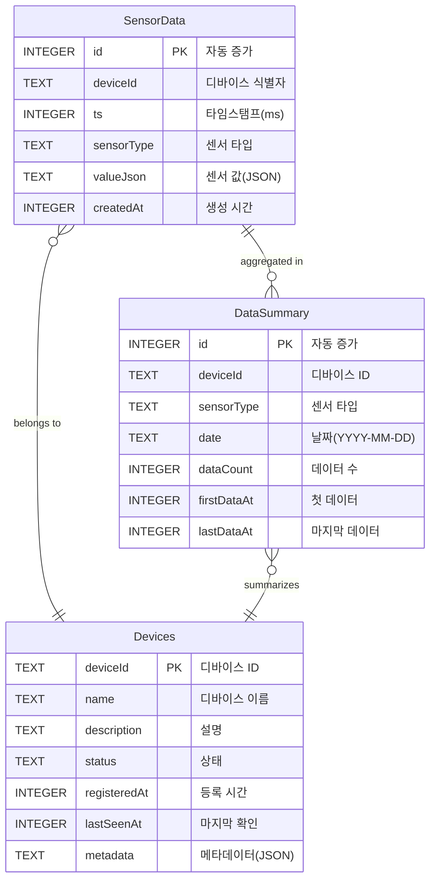
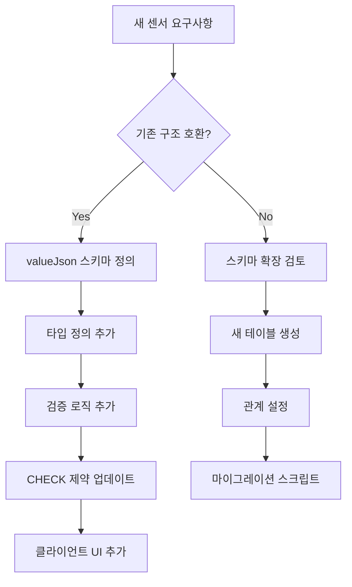
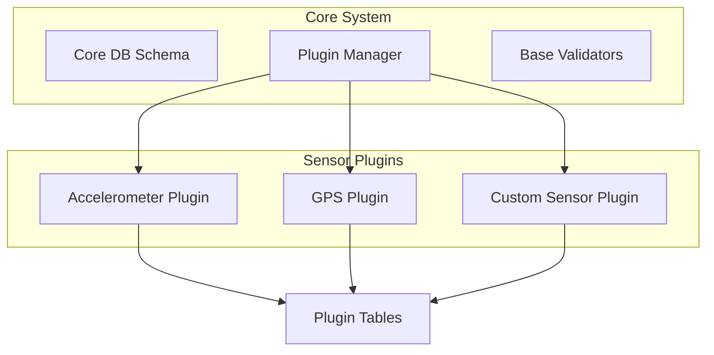

# AMR QC 솔루션 - DB 스키마 확장 전략 및 ERD

## 1. 현재 스키마 ERD



## 2. 센서 타입 확장 전략

### 2.1 현재 접근 방식: sensorType + valueJson

현재 스키마는 확장성을 고려하여 설계되었습니다:

```sql
-- 새로운 센서 타입 추가 시 CHECK 제약만 업데이트
ALTER TABLE SensorData DROP CONSTRAINT chk_sensorType;
ALTER TABLE SensorData ADD CONSTRAINT chk_sensorType
CHECK (sensorType IN ('accelerometer', 'gyroscope', 'gps', 'temperature',
                      'battery', 'magnetometer', 'proximity', 'light', 'pressure'));
```

### 2.2 JSON 활용 가변 스키마 예시

```json
// 기존 센서 (accelerometer)
{
  "x": 0.98,
  "y": -0.15,
  "z": 9.81
}

// 새로운 센서 타입 추가 예시
// proximity (근접 센서)
{
  "distance": 5.2,
  "unit": "cm",
  "detected": true
}

// light (조도 센서)
{
  "lux": 320,
  "colorTemp": 5500
}

// pressure (압력 센서)
{
  "pressure": 1013.25,
  "unit": "hPa",
  "altitude": 45.5
}
```

### 2.3 센서 타입 추가 절차



## 3. 스키마 확장 시나리오

### 3.1 시나리오 1: 단순 센서 추가

**요구사항**: 근접 센서(proximity) 추가

**구현**:

```sql
-- 1. CHECK 제약 업데이트
ALTER TABLE SensorData DROP CONSTRAINT chk_sensorType;
ALTER TABLE SensorData ADD CONSTRAINT chk_sensorType
CHECK (sensorType IN ('accelerometer', 'gyroscope', 'gps', 'temperature',
                      'battery', 'magnetometer', 'proximity'));

-- 2. 타입 정의 추가 (TypeScript)
export interface ProximityValue {
  distance: number;    // cm
  detected: boolean;
}

-- 3. 검증 로직 추가 (JavaScript)
validators.proximity = (data) => {
  return data.value.distance !== undefined &&
         typeof data.value.detected === 'boolean';
};
```

### 3.2 시나리오 2: 복합 센서 데이터

**요구사항**: 환경 센서 (온도 + 습도 + 압력 통합)

**구현 옵션 1**: valueJson 확장

```json
{
  "temperature": 23.5,
  "humidity": 65.2,
  "pressure": 1013.25,
  "dewPoint": 16.8
}
```

**구현 옵션 2**: 별도 테이블

```sql
CREATE TABLE EnvironmentData (
    id INTEGER PRIMARY KEY,
    deviceId TEXT NOT NULL,
    ts INTEGER NOT NULL,
    temperature REAL,
    humidity REAL,
    pressure REAL,
    dewPoint REAL,
    FOREIGN KEY (deviceId) REFERENCES Devices(deviceId)
);
```

### 3.3 시나리오 3: 이미지/바이너리 데이터

**요구사항**: 카메라 스냅샷 저장

```sql
-- 메타데이터는 기존 테이블 활용
INSERT INTO SensorData (deviceId, ts, sensorType, valueJson)
VALUES ('AMR-001', 1640995200000, 'camera',
        '{"filename": "snapshot_1640995200000.jpg", "size": 102400, "format": "jpeg"}');

-- 실제 이미지는 파일 시스템 저장
-- 경로: /data/images/AMR-001/snapshot_1640995200000.jpg
```

## 4. 데이터 마이그레이션 전략

### 4.1 스키마 버전 관리

```sql
CREATE TABLE IF NOT EXISTS SchemaVersion (
    version INTEGER PRIMARY KEY,
    appliedAt INTEGER DEFAULT (strftime('%s', 'now') * 1000),
    description TEXT
);
```

### 4.2 마이그레이션 스크립트 예시

```javascript
// migrations/001_add_proximity_sensor.js
module.exports = {
  up: (db) => {
    db.exec(`
      ALTER TABLE SensorData DROP CONSTRAINT chk_sensorType;
      ALTER TABLE SensorData ADD CONSTRAINT chk_sensorType 
      CHECK (sensorType IN ('accelerometer', 'gyroscope', 'gps', 
                            'temperature', 'battery', 'magnetometer', 'proximity'));
    `);
  },

  down: (db) => {
    // 되돌리기 로직
    db.exec(`
      DELETE FROM SensorData WHERE sensorType = 'proximity';
      ALTER TABLE SensorData DROP CONSTRAINT chk_sensorType;
      ALTER TABLE SensorData ADD CONSTRAINT chk_sensorType 
      CHECK (sensorType IN ('accelerometer', 'gyroscope', 'gps', 
                            'temperature', 'battery', 'magnetometer'));
    `);
  },
};
```

## 5. 플러그인 아키텍처 전환 고려사항

### 5.1 플러그인 기반 확장 구조



### 5.2 플러그인 인터페이스 설계

```typescript
interface SensorPlugin {
  name: string;
  sensorType: string;

  // 스키마 정의
  getSchema(): {
    tables?: TableDefinition[];
    validators: ValidatorFunction;
    typeDefinition: TypeDefinition;
  };

  // 데이터 처리
  processData(data: any): ProcessedData;

  // UI 컴포넌트
  getVisualizationComponent(): React.Component;
}
```

### 5.3 플러그인 등록 테이블

```sql
CREATE TABLE IF NOT EXISTS Plugins (
    pluginId TEXT PRIMARY KEY,
    name TEXT NOT NULL,
    version TEXT NOT NULL,
    sensorType TEXT UNIQUE,
    config TEXT,  -- JSON 설정
    installedAt INTEGER DEFAULT (strftime('%s', 'now') * 1000),
    enabled BOOLEAN DEFAULT 1
);
```

## 6. 성능 및 확장성 고려사항

### 6.1 파티셔닝 전략

```sql
-- 월별 파티션 테이블 (수동 구현)
CREATE TABLE SensorData_2024_01 AS SELECT * FROM SensorData WHERE 0;
CREATE TABLE SensorData_2024_02 AS SELECT * FROM SensorData WHERE 0;

-- 뷰로 통합 조회
CREATE VIEW SensorDataView AS
SELECT * FROM SensorData_2024_01
UNION ALL
SELECT * FROM SensorData_2024_02;
```

### 6.2 인덱스 전략 진화

```sql
-- 복합 인덱스 추가
CREATE INDEX idx_device_sensor_date
ON SensorData(deviceId, sensorType, date(ts/1000, 'unixepoch'));

-- 부분 인덱스 (특정 센서만)
CREATE INDEX idx_gps_location
ON SensorData(json_extract(valueJson, '$.latitude'),
              json_extract(valueJson, '$.longitude'))
WHERE sensorType = 'gps';
```

## 7. 장기 로드맵

### Phase 1 (현재): 단일 테이블 + JSON

- ✅ 빠른 개발
- ✅ 간단한 구조
- ✅ 유연한 확장

### Phase 2: 플러그인 아키텍처

- 모듈식 센서 지원
- 독립적인 업데이트
- 타사 센서 통합

### Phase 3: 분산 저장소

- 시계열 DB 도입 (InfluxDB)
- 이미지/파일 저장소 분리
- 마이크로서비스 전환

## 8. 모범 사례

### 8.1 센서 추가 체크리스트

- [ ] sensorType 값 정의
- [ ] valueJson 스키마 문서화
- [ ] TypeScript 타입 추가
- [ ] 검증 로직 구현
- [ ] DB 제약 조건 업데이트
- [ ] 단위 테스트 작성
- [ ] UI 컴포넌트 개발
- [ ] 마이그레이션 스크립트 준비

### 8.2 JSON 스키마 가이드라인

```json
{
  "필수값": "반드시 포함",
  "단위": "명시적으로 표현",
  "타임스탬프": "Unix ms 사용",
  "좌표계": "표준 준수 (WGS84 등)",
  "정밀도": "적절한 소수점 자리"
}
```

## 9. 결론

현재의 `sensorType + valueJson` 구조는 MVP 단계에서 충분한 확장성을 제공합니다. JSON 필드를 통해 새로운 센서 타입을 쉽게 추가할 수 있으며, 향후 플러그인 아키텍처로의 전환도 원활하게 진행할 수 있습니다.

주요 장점:

- ✅ 스키마 변경 없이 새 센서 추가 가능
- ✅ 하위 호환성 유지
- ✅ 점진적 마이그레이션 가능
- ✅ 플러그인 아키텍처로 진화 가능
