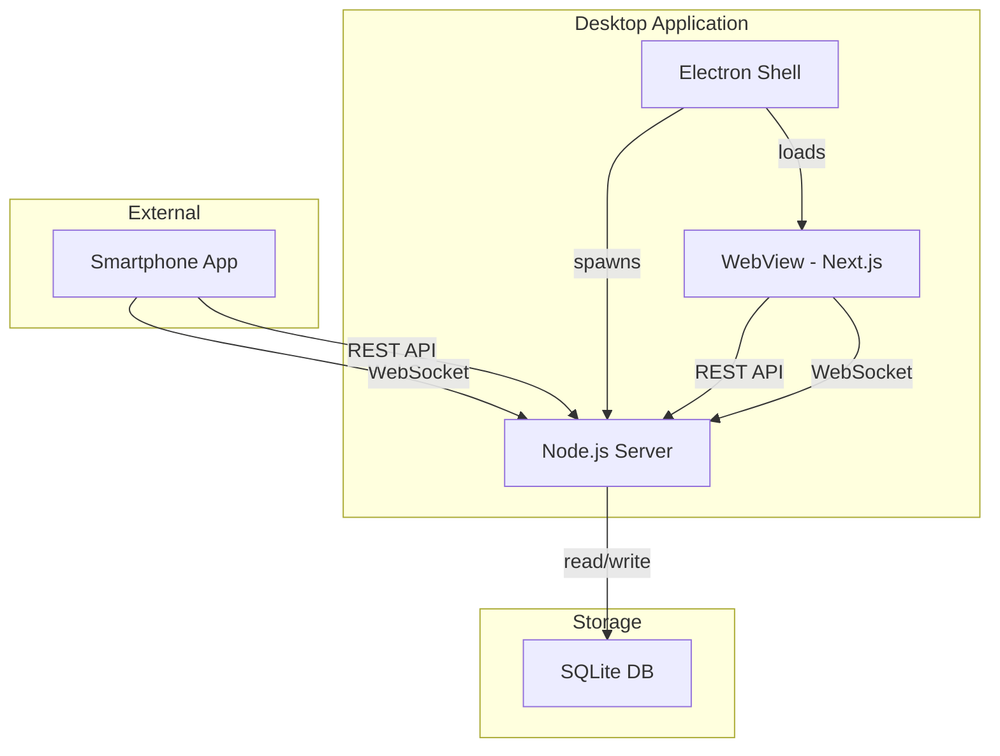
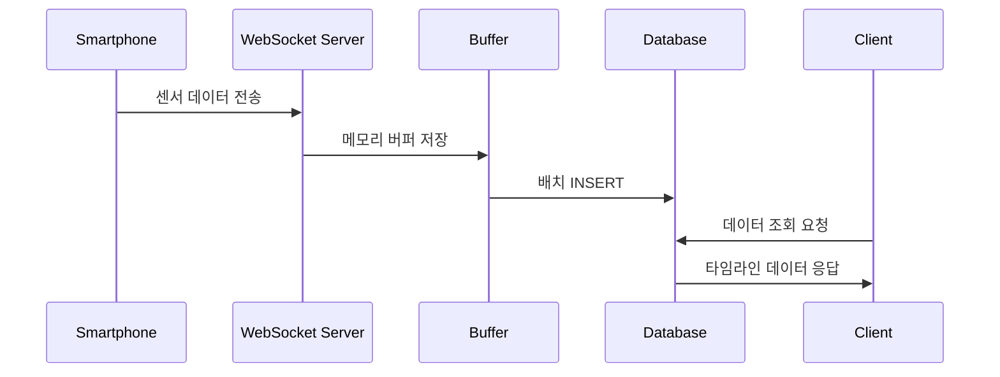

# AMR QC 솔루션 - 프로젝트 구조 설계 문서

## 프로젝트 개요

AMR QC 솔루션은 스마트폰 센서 스트리밍 데이터를 실시간으로 수집하고 시각화하는 Windows 기반 통합 시스템입니다. 단일 실행 파일(`.exe`)로 Electron Shell, Node.js 서버, WebView를 자동으로 기동합니다.

## 프로젝트 구조

```
amrqc-solution/
├── app/                      # Electron 메인 프로세스
│   ├── main.js              # Electron 엔트리 포인트
│   ├── preload.js           # 프리로드 스크립트
│   └── icon.ico             # 애플리케이션 아이콘
├── server/                   # Node.js 백엔드 서버
│   ├── index.js             # 서버 엔트리 포인트
│   ├── config.js            # 서버 설정
│   ├── db.js                # SQLite 데이터베이스 연결
│   ├── routes/              # API 라우트 정의
│   │   ├── data.js          # 데이터 조회/다운로드 API
│   │   └── websocket.js     # WebSocket 핸들러
│   ├── services/            # 비즈니스 로직 (Phase 2에서 확장)
│   └── middleware/          # Express 미들웨어
│       ├── error.js         # 에러 핸들링
│       └── logger.js        # winston 로깅
├── client/                   # Next.js 정적 클라이언트
│   ├── src/                 # 소스 코드
│   │   ├── app/             # App Router
│   │   ├── components/      # React 컴포넌트
│   │   │   ├── timeline/    # 타임라인 뷰 컴포넌트
│   │   │   ├── qrcode/      # QR 코드 생성
│   │   │   └── ui/          # shadcn-ui 컴포넌트
│   │   ├── features/        # 기능별 모듈
│   │   │   ├── sensor/      # 센서 데이터 처리
│   │   │   └── device/      # 디바이스 관리
│   │   ├── hooks/           # React hooks
│   │   ├── lib/             # 유틸리티 함수
│   │   └── constants/       # 상수 정의
│   ├── public/              # 정적 자원
│   ├── next.config.js       # Next.js 설정
│   └── package.json         # 클라이언트 의존성
├── shared/                   # 공통 모듈
│   ├── types/               # TypeScript 타입 정의
│   │   ├── sensor.d.ts      # 센서 데이터 타입
│   │   ├── api.d.ts         # API 인터페이스
│   │   └── database.d.ts    # DB 스키마 타입
│   └── utils/               # 공통 유틸리티
│       ├── validator.js     # 데이터 검증
│       └── formatter.js     # 데이터 포맷팅
├── installer/                # 설치 파일 설정
│   ├── build/               # 빌드 출력
│   └── electron-builder.yml # electron-builder 설정
├── tests/                    # 테스트 코드
│   ├── unit/                # 단위 테스트
│   ├── integration/         # 통합 테스트
│   └── e2e/                 # E2E 테스트
├── data.db                  # SQLite 데이터베이스 파일
├── package.json             # 루트 의존성 관리
├── .env.example             # 환경 변수 예시
└── README.md                # 프로젝트 문서

```

## 디렉터리별 상세 설명

### `/app` - Electron 메인 프로세스

- **책임**: 데스크톱 애플리케이션 셸 관리
- **주요 기능**:
  - Node.js 서버 프로세스 실행
  - WebView로 Next.js 클라이언트 로드
  - 시스템 트레이 관리
  - 자동 업데이트 처리

### `/server` - Node.js 백엔드

- **책임**: 데이터 수집, 저장, API 제공
- **주요 기능**:
  - WebSocket 서버로 실시간 센서 데이터 수신
  - REST API 엔드포인트 제공
  - SQLite 데이터베이스 관리
  - 로깅 및 모니터링

### `/client` - Next.js 프론트엔드

- **책임**: 사용자 인터페이스 제공
- **주요 기능**:
  - 타임라인 뷰 (리스트/그래프 모드)
  - 디바이스별 데이터 필터링
  - QR 코드 생성 및 표시
  - 데이터 다운로드 기능

### `/shared` - 공통 모듈

- **책임**: 클라이언트/서버 간 공유 코드
- **주요 기능**:
  - TypeScript 타입 정의
  - 데이터 검증 로직
  - 공통 유틸리티 함수

## 센서 타입 확장 가이드

새로운 센서 타입을 추가하려면:

1. **타입 정의 추가** (`/shared/types/sensor.d.ts`):

```typescript
export interface NewSensorData {
  sensorType: "newSensor";
  value: {
    // 센서별 데이터 구조
  };
}
```

2. **검증 로직 추가** (`/shared/utils/validator.js`):

```javascript
validators.newSensor = (data) => {
  // 데이터 검증 로직
};
```

3. **시각화 컴포넌트 추가** (`/client/src/components/timeline/`):

```jsx
export const NewSensorChart = ({ data }) => {
  // Chart.js를 사용한 시각화
};
```

## 시스템 아키텍처 다이어그램



## 데이터 플로우



## 개발 환경 설정

1. **필수 요구사항**:

   - Node.js LTS (v20.x)
   - Windows 10/11 64-bit
   - npm 또는 yarn

2. **의존성 설치**:

```bash
# 루트 디렉터리에서
npm install

# 클라이언트 디렉터리에서
cd client && npm install
```

3. **개발 서버 실행**:

```bash
# 개발 모드로 실행
npm run dev

# 프로덕션 빌드
npm run build

# 설치 파일 생성
npm run dist
```

## 확장 가능성

- **Phase 2**: 서비스 레이어 분리, 리포지토리 패턴 도입
- **Phase 3**: 플러그인 아키텍처, AI 이상 탐지 모듈

## 참고사항

- 모든 센서 데이터는 `sensorType` 필드로 구분
- JSON 형태로 `valueJson` 필드에 저장하여 확장성 확보
- 최대 5대 동시 스트리밍 지원을 위한 성능 최적화 적용
